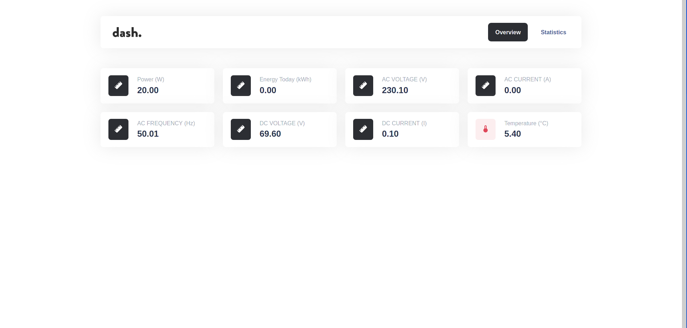
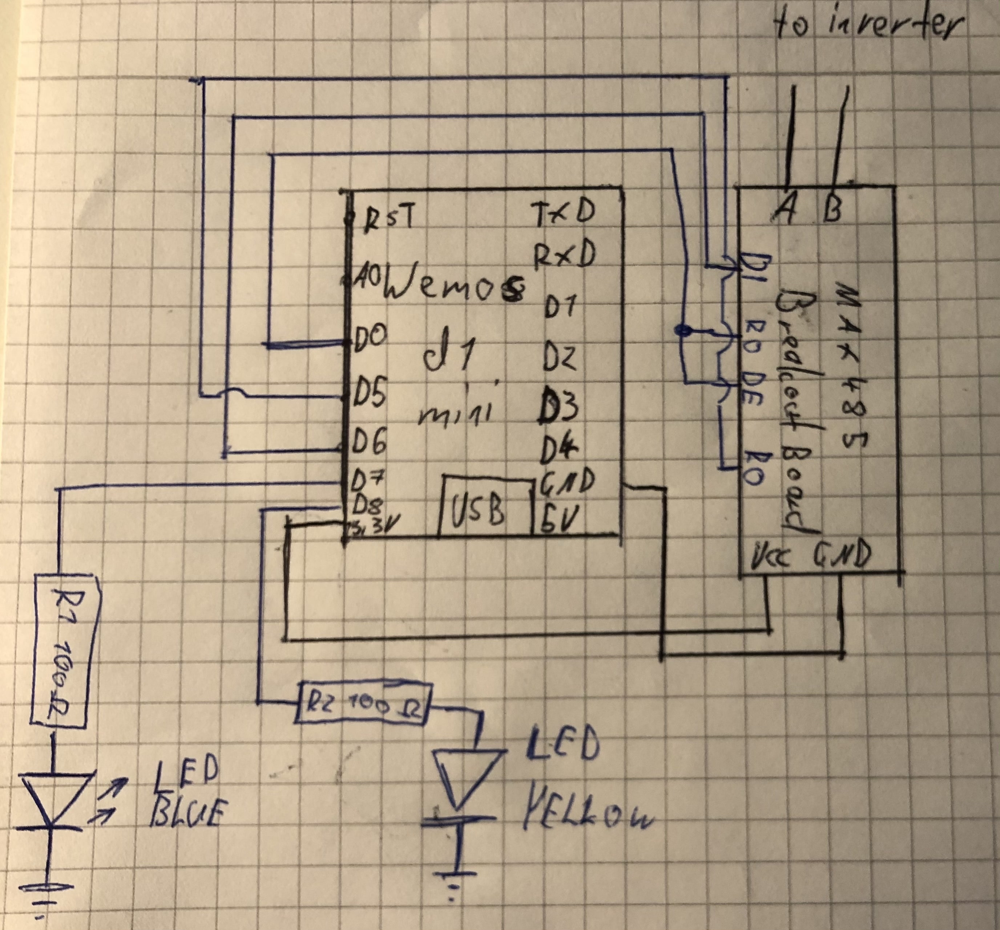
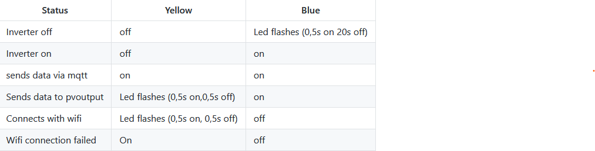

### Features
- MQTT
- Webinterface (Based on [ESPDash](https://github.com/ayushsharma82/ESP-DASH))
- Write data in an influxdb-database
- Send data to [PVOutput](https://pvoutput.org/)

### Screenshot from webinterface

### Used Hardware
- Wemos d1 mini
- Max485
- 2 leds (blue, yellow)
- 2 100 Ohm-resistors
- ds18b20 (optional, but recommended)
- 4.7k resistor (for ds18b20)

### Schematic

### Steps to build - software
0. Install VSCode and platformIO
1. Download or clone this repository
2. Rename the file src/config.h.example to src/config.h
3. Configure it in src/config.h
4. Compile, upload and test your device.
#### More detailed instructions: [https://10k-resistor.github.io/Solis4Gmini-logger/instructions/detailed/](https://10k-resistor.github.io/Solis4Gmini-logger/instructions/detailed/)

 
### Status leds

### Known problems
 - ESP sometimes crashes while ntp sync
