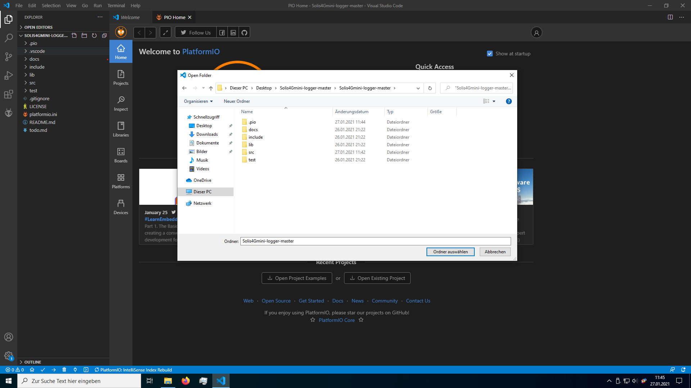
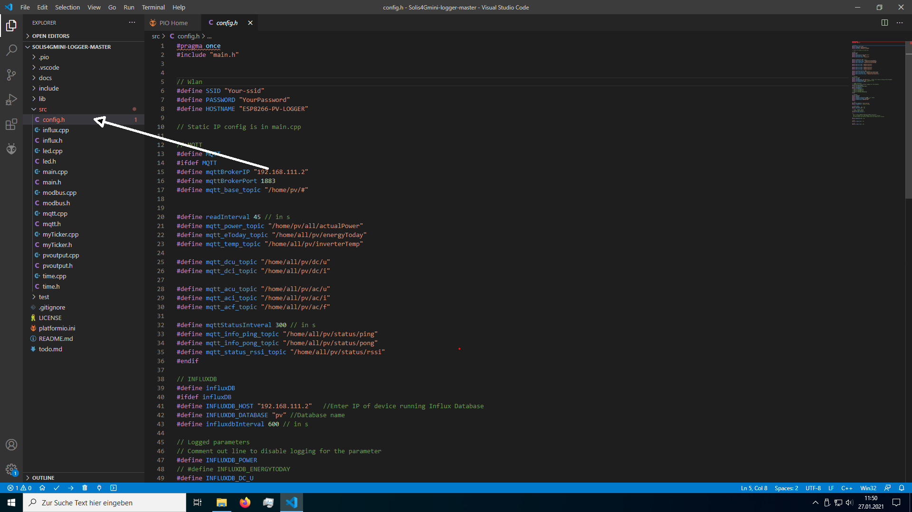
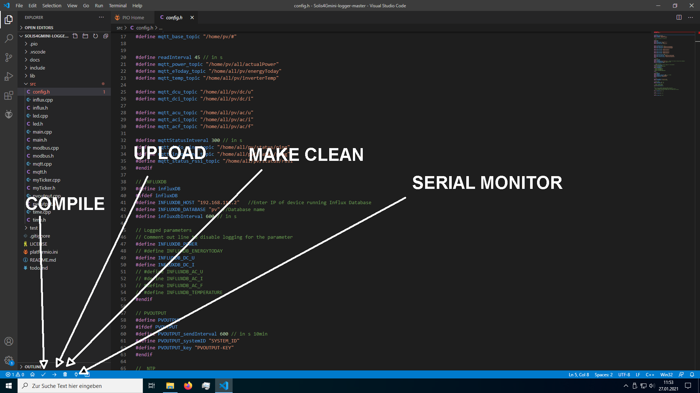

# Detailed compile and upload instructions

## PlatformIO
0. Install VSCode and platformIO
1. Clone or [download](https://github.com/10k-resistor/Solis4Gmini-logger/archive/master.zip) this repository
2. Rename the file config.h.example to config.h . The file is in the src folder.
3. Open the root folder (the folder with the platformio.ini file.) in VSCode.
4. Press **Ctrl+Shift+e** to open the explorer in VScode. There you open the folder src and open the file config.h . 
5. Change you Wifi-credentials and the hostname in this file. You can set an static IP-address in the main.cpp file. 
6. Configure PVoutput, influxdb and mqtt. If you have no idea what this is, leave the settings as they are.
7. Press the compile button. 
8. After it has finished compiling you upload the code with the upload-button.
9. Get the IP from your ESP and open it in a browser.
10. Connect your ESP8266 to your inverter.

## Arduino IDE
0. Install the Arduino IDE and the [ESP8266-Core](https://github.com/esp8266/Arduino#installing-with-boards-manager).
1. Install all libraries. Here is a list with all used libraries:
 * [Modbus Master https://github.com/4-20ma/ModbusMaster](https://github.com/4-20ma/ModbusMaster)
 * [ESPDash https://github.com/ayushsharma82/ESP-DASH](https://github.com/ayushsharma82/ESP-DASH)
 * [ESPAsyncTCP https://github.com/me-no-dev/ESPAsyncTCP](https://github.com/me-no-dev/ESPAsyncTCP)
 * [ESPAsyncWebserver https://github.com/me-no-dev/ESPAsyncWebServer](hhttps://github.com/me-no-dev/ESPAsyncWebServer)
 * [ArduinoJson  https://github.com/bblanchon/ArduinoJson](https://github.com/bblanchon/ArduinoJson)
 * [PubSubClient https://github.com/knolleary/pubsubclient](https://github.com/knolleary/pubsubclient)
 * [InfluxDB-Client-for-Arduino  https://github.com/tobiasschuerg/InfluxDB-Client-for-Arduino]( https://github.com/tobiasschuerg/InfluxDB-Client-for-Arduino)
 * [Time https://github.com/PaulStoffregen/Time](https://github.com/PaulStoffregen/Time)
 * [NTPClient https://github.com/arduino-libraries/NTPClient](https://github.com/arduino-libraries/NTPClient)
 * [OneWire https://github.com/PaulStoffregen/OneWire](https://github.com/PaulStoffregen/OneWire)
2. Rename the file config.h.example to config.h . The file is in the src folder.
3. Open the file src.ino with the Arduino IDE.
4. Change your WiFi-Credentials (and all the other stuff) in the config.h file.
5. Compile and Upload.
6. Get the IP from your ESP and open it in a browser.
7. Connect it to your inverter.

[Home](https://10k-resistor.github.io/Solis4Gmini-logger/)
